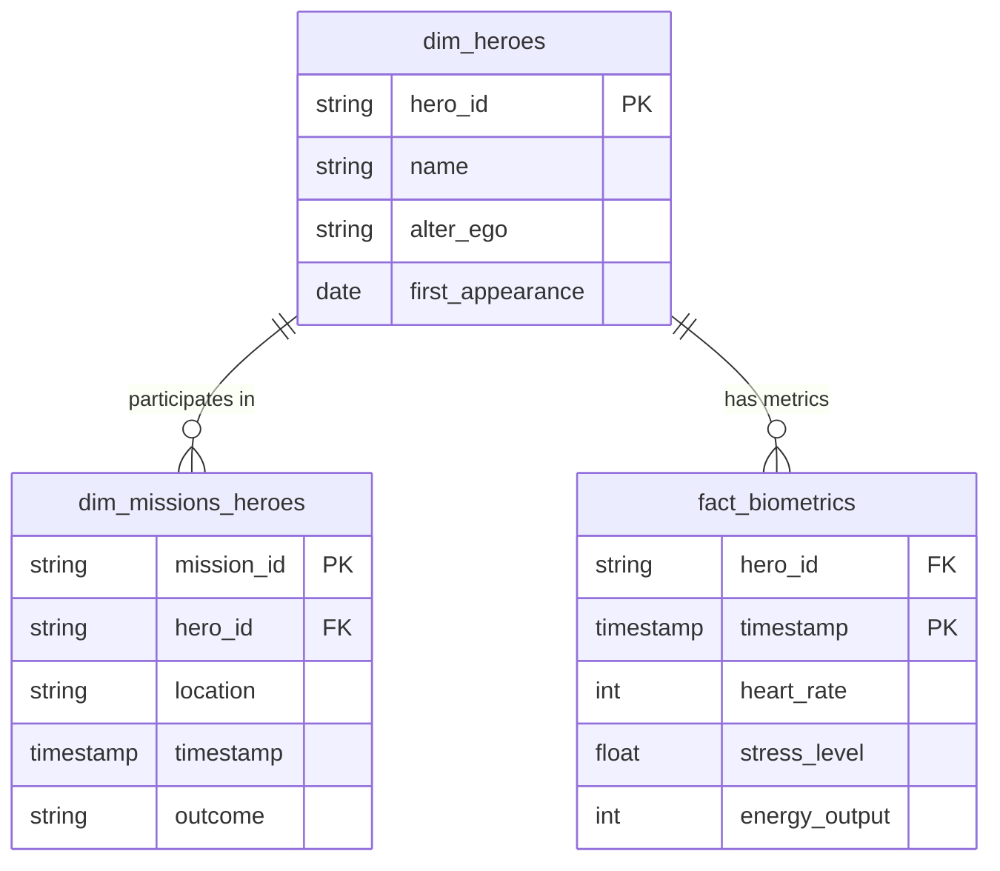

# Entity Relationship Diagram

## Table Descriptions

- **dim_heroes**: Contains static metadata about heroes (names, IDs).
- **dim_missions_heroes**: Links missions to heroes. Since missions can have multiple heroes, this acts as a bridge table (or factless fact table) with mission details.
- **fact_biometrics**: Time-series data containing biometric readings for each hero.
